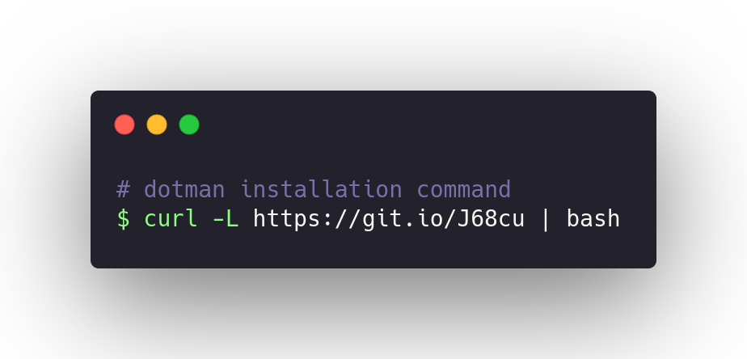

<div align="center">


</div>

# Dotman
The dotfile manager you are searching for...

## Documentation

Dotman documentation is up!!
check it out at [**d3r1n.github.io/dotman**](https://d3r1n.github.io/dotman)

## Version History
- v0.4 [Now]
	* Better Documentation - [Main Feature]
	* Website? - [Main Feature]
	* Multiple Installer Scripts - [Main Feature]
- v0.3
	* Automatic Generated installer script - [Main Feature]
	* Status Commands
	* Dotman Binary installing script
	* Bug fixes
- v0.2
	* Automatic git support added - [Main Feature]
	* Lots of bug fixes
- v0.1
	* Initial version of Dotman

## Installation

Just Execute this command to install the dotman from source



**Requirements**:
- Go **1.17** or *higher*.

```bash
curl -L https://git.io/J68cu | bash
```
**or**

```bash
curl https://raw.githubusercontent.com/d3r1n/dotman/master/linux_installer.sh | bash
```


<div align="center">

If you liked this project please leave a star, it helps a lot :3

</div>